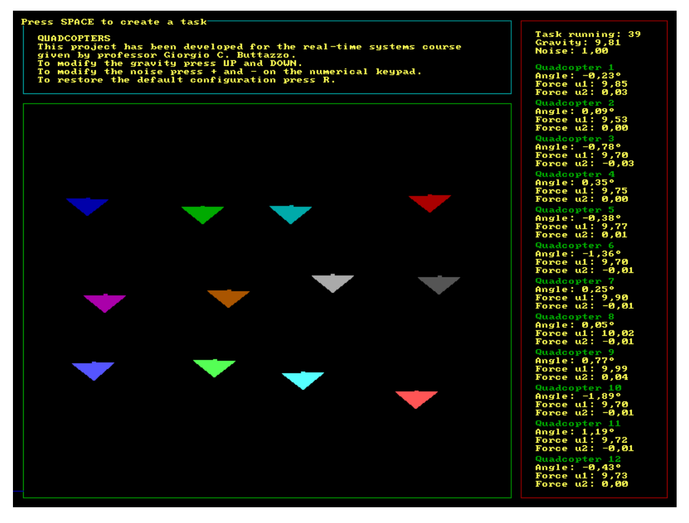
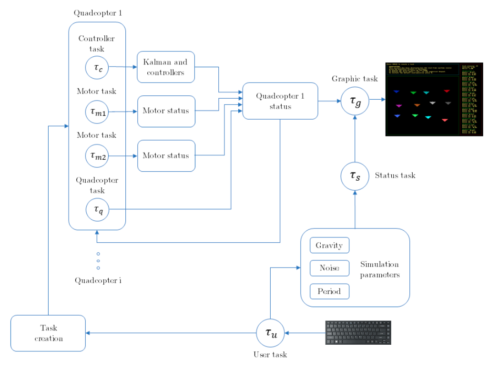

# Quadcopter Simulation Project

## Overview

This project is a sophisticated simulation of 2D quadcopters developed as part of the Real-Time Systems course for the Embedded Computing Systems Master's Degree. The simulation showcases the integration of advanced control systems, real-time computing principles, and state estimation techniques.

At its core, the project simulates multiple quadcopters that navigate using noisy GPS positions. To enhance accuracy and stability, the system employs a Kalman filter for state estimation, effectively mitigating the impact of sensor noise on the quadcopters' performance.

*Graphical interface of the application*

## Technical Details

The simulation is built using the C programming language, leveraging the Allegro library for graphical rendering. This combination allows for a real-time, visually intuitive representation of the quadcopters' behavior.

The system architecture is designed around a multitasking paradigm, efficiently managing several concurrent processes:

1. A user task serves as the primary interface, generating other tasks and processing user inputs.
2. A status task continuously refreshes the simulation parameters, providing real-time feedback.
3. A graphic task handles the visual updates of the simulation area and quadcopter parameters.
4. For each quadcopter, a dedicated controller task estimates position and manages force control.
5. Individual quadcopter tasks calculate rotor angular velocities and update the overall status.
6. Twin motor tasks per quadcopter handle the intricate control of the propulsion system.

The project incorporates several key components that contribute to its realism and effectiveness:

The quadcopter dynamics are modeled with high fidelity, accounting for the complex interplay of forces acting on the aircraft. This model is then linearized to facilitate the design of an effective control system.

At the heart of the navigation system lies a Kalman filter. This sophisticated algorithm fuses sensor data with the quadcopter's dynamic model to provide optimal state estimates, crucial for stable and accurate flight control.

Task scheduling is managed using the Earliest Deadline First (EDF) algorithm, ensuring that critical processes are executed in a timely manner, which is essential for the real-time nature of the simulation.

*Tasks structure diagram*

## User Interface

The simulation is presented through an 800x600 window, thoughtfully divided into three main areas:

1. A menu area provides essential information about the project and instructions for user interaction.
2. A status area displays real-time information about each quadcopter's current state.
3. The main box area visualizes the actual simulation, allowing users to observe the quadcopters in action.

Users can interact with the simulation by adjusting various parameters via keyboard inputs. Quadcopter flights can be initiated with a simple press of the SPACE key. For a more hands-on experience, users can even manipulate the quadcopters' setpoints by dragging them with the mouse within the simulation area.

## Performance and Experimental Results

The project includes a series of experimental results that demonstrate its robustness and effectiveness:

1. System stability has been tested under various sampling times, showcasing the control system's adaptability.
2. Performance evaluations under different noise conditions highlight the system's resilience to sensor inaccuracies.
3. Specific experiments underscore the effectiveness of the Kalman filter in high-noise scenarios, illustrating its crucial role in maintaining stable flight.

## Project Structure and Compilation

The project is organized into a clear directory structure:

- The `src` directory houses all the source code files.
- Compiled object files are stored in the `obj` directory.
- Executable files can be found in the `bin` directory.

Compilation is streamlined through the use of a Makefile, offering several options:

- Running `make all` compiles the entire codebase and generates all executable files.
- For those interested in the EDF scheduling algorithm, `make edf` compiles the code with the EDF macro.
- Alternatively, `make fifo` compiles the code using the FIFO macro for a different scheduling approach.

## Conclusion

This quadcopter simulation project represents a sophisticated blend of real-time systems, control theory, and state estimation. It offers valuable insights into the challenges and solutions involved in autonomous aerial vehicle control, serving as both an educational tool and a foundation for further research in the field.

